# Лабораторна робота №7: Дослідження фільтра Калмана

## Посилання

[Демонстрація роботи системи на CodePen](https://codepen.io/VolodimirProdan/full/RNbRvxG)

## Мета роботи
Ознайомитися з роботою фільтра Калмана та принципами його застосування, дослідити вплив різних параметрів фільтра на результати згладжування сигналу.

## Теоретичні відомості
Фільтр Калмана — це метод математичної фільтрації, який використовується для усунення шумів із даних та підвищення точності вимірювань. Він базується на двох основних етапах: передбачення та оновлення на основі нових даних.

## Результати дослідження

### 1. Базова робота фільтра
На рисунку 1 показано базову роботу фільтра Калмана з початковими параметрами. Синя лінія показує істинний сигнал, помаранчева - зашумлений сигнал, а зелена - відфільтрований сигнал.

  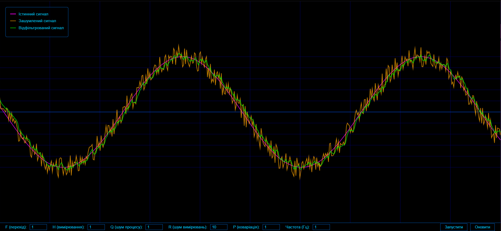
   
  <em>Рис. 1 - Демонстрація роботи фільтра з базовими параметрами</em>

### 2. Дослідження параметра Q (матриця коваріації шуму процесу)
Матриця Q відображає рівень довіри до моделі процесу. Більші значення Q означають, що ми менше довіряємо моделі і очікуємо більших випадкових змін у системі.

#### Експеримент 1: Збільшення Q
При збільшенні Q до 100 (початкове значення 1) фільтр стає більш чутливим до змін у вхідному сигналі, що призводить до швидшої реакції на зміни, але меншого згладжування шуму:

  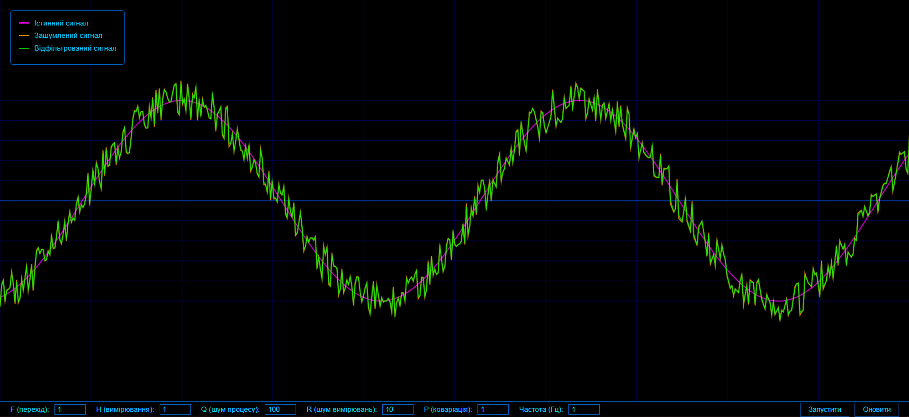
   
  <em>Рис. 2 - Результат фільтрації при збільшеному значенні Q (Q=100)</em>

#### Експеримент 2: Зменшення Q
При зменшенні Q до 0.01 спостерігається краще згладжування шуму, але повільніша реакція на зміни сигналу:

  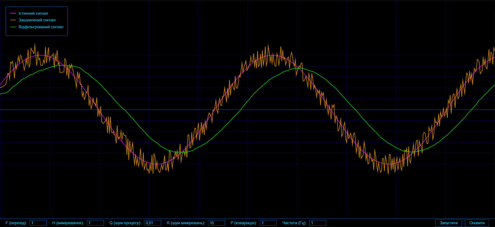
   
  <em>Рис. 3 - Результат фільтрації при зменшеному значенні Q (Q=0.01)</em>

### 3. Дослідження параметра R (матриця коваріації шуму вимірювання)
Матриця R характеризує рівень довіри до вимірювань. Більші значення R означають, що ми менше довіряємо вимірюванням і більше покладаємося на модель процесу.

#### Експеримент 1: Збільшення R
При збільшенні R до 50 (початкове значення 10) фільтр надає більше ваги моделі процесу, що призводить до більшого згладжування:

  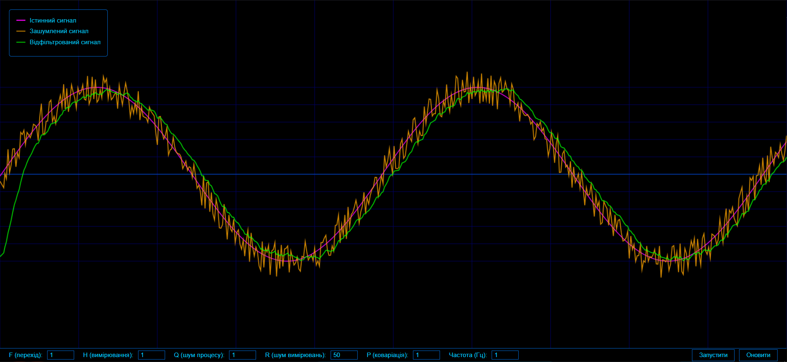
   
  <em>Рис. 4 - Результат фільтрації при збільшеному значенні R (R=50)</em>

#### Експеримент 2: Зменшення R
При зменшенні R до 1 фільтр стає більш чутливим до нових вимірювань, що призводить до швидшої реакції на зміни, але меншого згладжування шуму:

  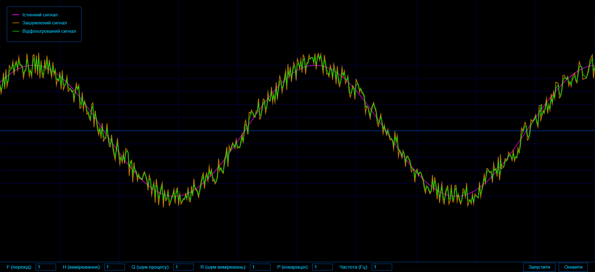
   
  <em>Рис. 5 - Результат фільтрації при зменшеному значенні R (R=1)</em>

### 4. Дослідження початкової матриці коваріації P
Матриця P відображає початкову невпевненість у стані системи. Більші значення P означають меншу довіру до початкового стану і більшу готовність до швидкої корекції на основі вимірювань.

#### Експеримент 1: Збільшення P
При збільшенні P до 1000 (початкове значення 1) фільтр швидше адаптується до вимірювань на початковому етапі:

  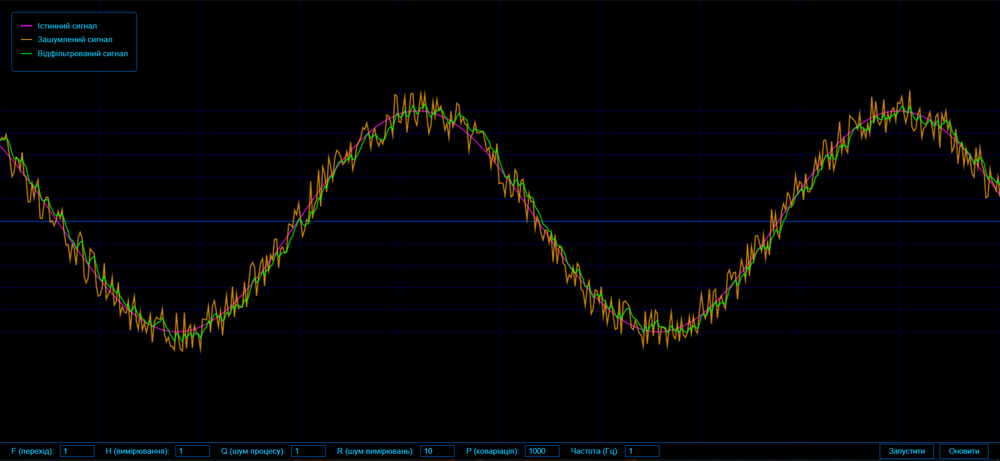
   
  <em>Рис. 6 - Результат фільтрації при збільшеному значенні P (P=1000)</em>

#### Експеримент 2: Зменшення P
При зменшенні P до 0.1 фільтр демонструє більшу інерційність на початковому етапі роботи:

  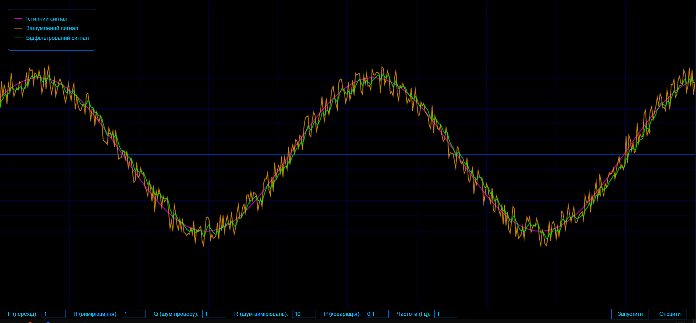
   
  <em>Рис. 7 - Результат фільтрації при зменшеному значенні P (P=0.1)</em>

### 5. Дослідження початкової оцінки стану (x)
Початкова оцінка стану визначає точку, з якої фільтр починає роботу. Цей параметр особливо важливий для оцінки швидкості збіжності фільтра.

#### Експеримент 1: Високе початкове значення
При встановленні x = 20 (початкове значення 0) спостерігається значне початкове відхилення, але фільтр поступово збігається до правильних значень:

  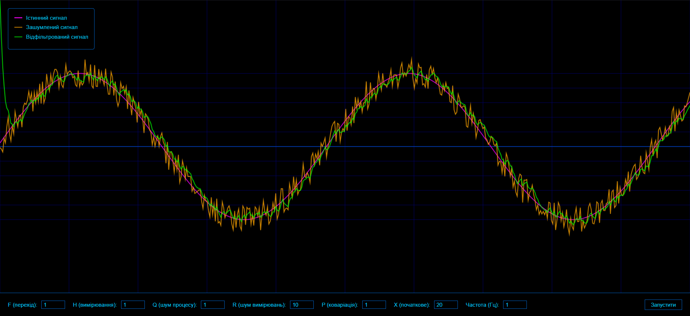
   
  <em>Рис. 8 - Результат фільтрації при високому початковому значенні (x=20)</em>

#### Експеримент 2: Низьке початкове значення
При встановленні x = -10 фільтр демонструє здатність швидко адаптуватися навіть при значному початковому відхиленні:

  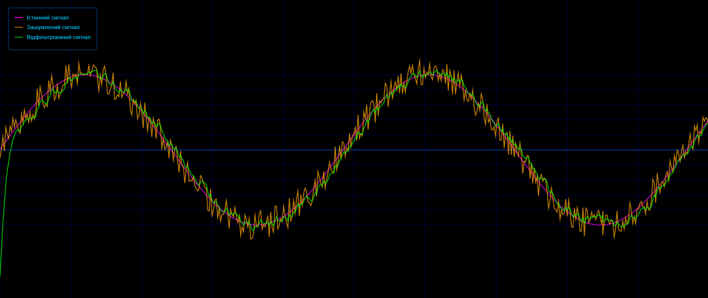
   
  <em>Рис. 9 - Результат фільтрації при низькому початковому значенні (x=-10)</em>

### 6. Дослідження постійної складової сигналу (offset)
Параметр offset визначає зсув сигналу відносно нуля. Цей параметр дозволяє оцінити здатність фільтра працювати з сигналами різного рівня.

#### Експеримент 1: Збільшення offset
При збільшенні offset до 5 спостерігається зміщення всього сигналу вгору:

  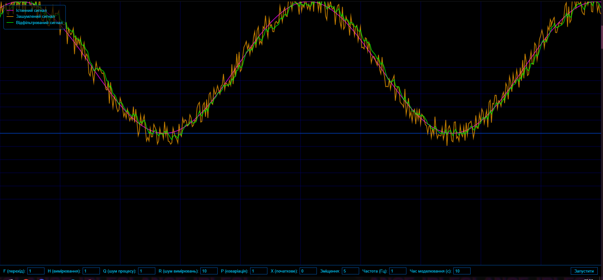
   
  <em>Рис. 10 - Результат фільтрації при збільшеному значенні offset (offset=5)</em>

 
#### Експеримент 2: Зменшення offset
При зменшенні offset до -5 сигнал зміщується до нульового рівня:

  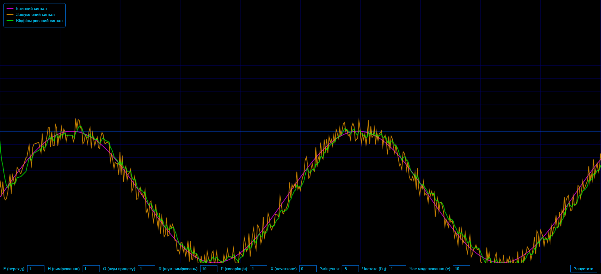
   
  <em>Рис. 11 - Результат фільтрації при зменшенному значенні offset</em>

## Висновки

В ході виконання лабораторної роботи було досліджено принципи роботи фільтра Калмана та його поведінку при різних параметрах. Проведені експерименти показали, що фільтр ефективно справляється із задачею очищення сигналу від шуму, при цьому його ефективність суттєво залежить від правильного налаштування параметрів. Найбільш критичним виявився вплив матриць Q та R, які визначають баланс між швидкістю реакції фільтра та якістю фільтрації.
При збільшенні довіри до моделі процесу (зменшення Q) фільтр краще згладжував шум, але повільніше реагував на реальні зміни сигналу. Натомість, при збільшенні довіри до вимірювань (зменшення R) фільтр швидше відслідковував зміни, але пропускав більше шуму. Експерименти з початковими умовами показали, що фільтр добре адаптується до різних початкових станів та демонструє стабільну роботу при тривалому моделюванні.
В результаті досліджень були визначені оптимальні параметри для ефективної фільтрації сигналу, що дозволяє застосовувати отримані знання при розробці реальних систем фільтрації та обробки сигналів.

6. **Вплив часу моделювання**:
   - Більший час дозволяє краще оцінити стабільність роботи
   - Менший час корисний для аналізу початкової збіжності

Для інтерактивної демонстрації роботи фільтра Калмана рекомендується відвідати [демонстраційну версію](https://codepen.io/VolodimirProdan/full/azoZXvX) проекту.
